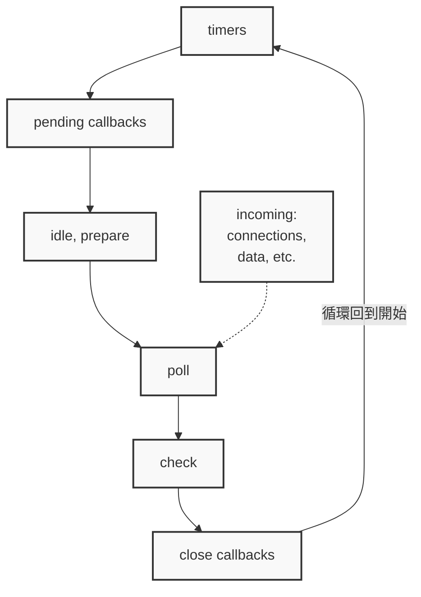

# JavaScript

JavaScript 本身是同步(synchronous)、單執行緒(single-threaded)的語言，它無法直接處理異步(asynchronous)操作。但透過瀏覽器或 Node.js 提供的 API，以及事件迴圈機制，JavaScript 才能以非同步的方式執行任務。

# Node.js 
Node.js 是基於 Chrome V8 引擎開發的執行環境，讓 JavaScript 不再侷限於瀏覽器中執行，而能在伺服器端使用。

# Event Loop
Event Loop（事件迴圈）是 JavaScript 執行環境中負責協調同步與非同步任務的核心機制。 在 Node.js 中，事件迴圈由底層的 [Libuv](https://github.com/libuv/libuv) 實作。Libuv 是一個以 C 語言編寫的跨平台開源庫，提供事件迴圈、非同步 I/O、thread pool 以及跨平台抽象等功能。  

## Event Loop 的執行邏輯
簡單來說 Event Loop 就是多種不一樣的 Queue 執行的順序並且不斷循環的機制。以下會以 Node.js 的 Event Loop 來介紹

下圖是在 Node.js 的事件迴圈中，各個階段的隊列（如 timers、check、close callbacks 等）的執行順序


流程如下：
1. **timers** ↓
2. **pending callbacks** ↓
3. **idle, prepare** ↓
4. **poll** ← incoming: connections, data, etc.
5. **check** ↓
6. **close callbacks** ↓
7. → 回到第1步 (循環)

### Task 每個階段解說
- Timer：顧名思義就是計時器相關的 Ex: setTimeout()、setInterval()
- Pending callbacks：這一層的主要是處理作業系統的層級(TCP Errors、Sockets 拒絕連線)
- Idle, Prepare：僅在內部使用。 （目前在官方沒有找到這部分的解說）
- Poll：檢索新的 I/O 事件；執行 I/O 相關的回調函數，幾乎所有回調函數，除了關閉回調、由定時器排程的回調，以及 setImmediate() 之外）
  - 1.檢索新的 I/O 事件
    - 檢查是否有新的文件讀寫、網絡請求等 I/O 操作完成
    - 例如：文件讀取完成、HTTP 請求收到回應等
  - 2.執行 I/O 相關的回調函
    - 執行大部分的回調函數
    - 不包括以下：
      - close 事件的回調（如文件關閉、連線斷開）
      - setTimeout、setInterval 等定時器的回調
      - setImmediate() 的回調
  - 3.適當時會阻塞
    - 如果沒有其他階段的任務等待執行
    - Node.js 會在這裡等待新的 I/O 事件
    - 這樣可以避免 CPU 空轉，提高效率
    - 次階段以設定執行上限，到達上限時就會將 Queue 內的東西移交到 pending callbacks 階段的 Queue 中，下一個事件迴圈時再接續執行。
- Check：setImmediate() 的 callbacks 是在這邊調用
- Close callbacks：處理關閉連線、檔案的 callback

### Microtask Queue
1. Promise 相關
    - Promise.then() - Promise 成功時的回調
    - Promise.catch() - Promise 失敗時的回調
    - Promise.finally() - Promise 完成時的回調
    - async/await - async 函數中 await 後的代碼
2. queueMicrotask()
    - 直接將任務放置在 microtask Queue
> 備注：Promise 的建構函數是同步執行的，但 .then()、.catch()、.finally() 等回調會進入 Microtask Queue

### setImmediate() 對比 setTimeout()
- setImmediate()：是在當前的 Poll 完成後執行
- setTimeout()：排程一個腳本在經過最少閾值毫秒數後執行

計時器的執行順序取決於呼叫它們的上下文。如果兩者都在主模組中調用，則計時將受進程效能的約束（進程效能可能會受到電腦上執行的其他應用程式的影響）。

舉例：在不執行 I/O 週期值些呼叫以下程式碼，無法確認它的順序，因為它受流程效能的約束
``` javascript
setTimeout(() => {
  console.log('timeout');
}, 0);
setImmediate(() => {
  console.log('immediate');
});
```

但如果是在 I/O 週期內使用(如下) setImmediate() 會在任何計時器之前執行，而不管存在多少計時器。
``` javascript
const fs = require('node:fs');

fs.readFile(__filename, () => {
  setTimeout(() => {
    console.log('timeout');
  }, 0);
  setImmediate(() => {
    console.log('immediate');
  });
});

```

## process.nextTick()
 TODO: 
